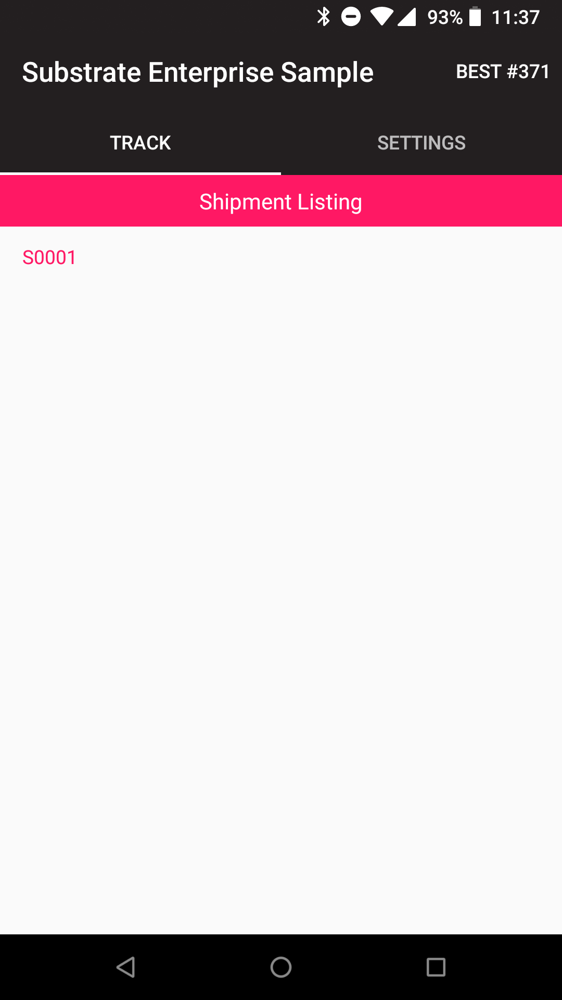
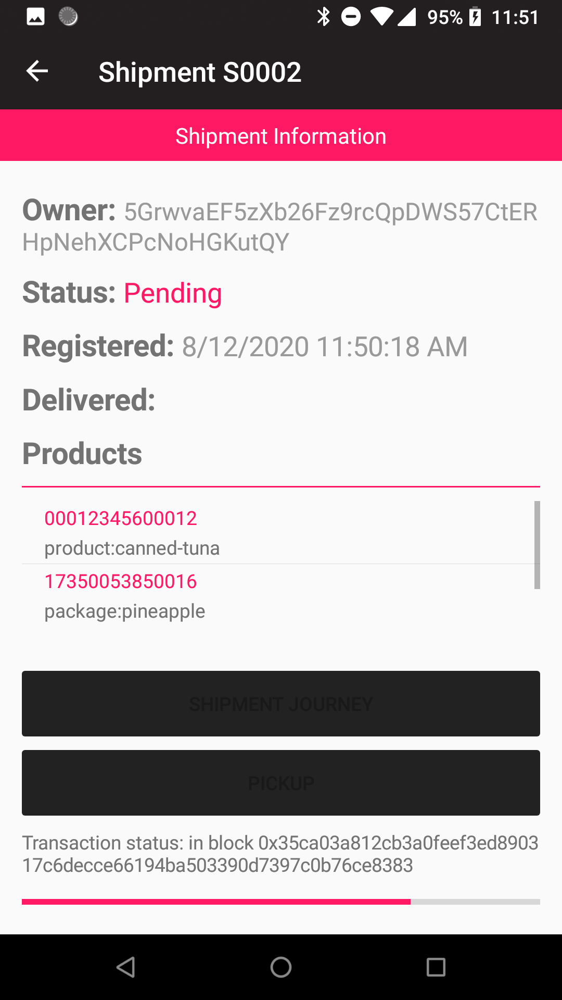

# Substrate Enterprise Sample app

The **Substrate Enterprise Sample app** implements functionalities for tracking shipments being transported within a fictitious supply chain between various stakeholders, and for capturing their storage and transportation conditions.

It is part of the [Substrate Enterprise sample](https://github.com/substrate-developer-hub/substrate-enterprise-sample), and works in tandem with the [web frontend](https://github.com/substrate-developer-hub/substrate-enterprise-sample/tree/master/ui) that allows to manage organizations and their roles, as well as products and shipments.

Interestingly, the app demonstrates how to embed a Substrate light-client node within a mobile Android application, and how to use the Substrate RPC API to interact with the embedded node to query for storage state, and to submit transactions with extrinsics calling into functionalities from the product [registry](https://github.com/stiiifff/pallet-product-registry) & [tracking](https://github.com/stiiifff/pallet-product-tracking) pallets.

The high-level flow is shown below.


It is inspired by existing projects & standards:
- [IBM Food Trust](https://github.com/IBM/IFT-Developer-Zone/wiki/APIs)
- [Hyperledger Grid](https://www.hyperledger.org/use/grid)
- [GS1 Standards](https://www.gs1.org/standards)

NOTE: This app implements the aforementionned process in a simplified way, thus it is intended for demonstration purposes and is not audited or ready for production use.

## Screenshots


### Shipment tracking

<p>When using the sample's chain init script, Shipment S0001 has already been delivered.</p>



<p>Create a new Shipment S0002 in the web frontend, then perform the Pickup operation in the app.
<br/>Once marked as picked up, the Scan & Deliver shipping operations are available.</p>




### Node information

<p>The Settings page displays basic information about the Node and current Peers.<br/>
The button at the bottom of the page allows to view the node's logs.</p>


## How to test the app

1. First, you need to spin up a test net with 2 or 3 nodes (e.g. Alice, Bob, Charlie), and execute the provided chain init script. See the [instructions](https://github.com/substrate-developer-hub/substrate-enterprise-sample) in the Enterprise sample repo.
2. Install the mobile app on your Android device. You can use the provided APK file in the release folder, and deploy it using the Android `adb` utility with the following command:

```bash
adb install io.parity.substrate.enterprisesample.apk
```

3. Then start the app. It should indicate when the node is ready, and it should start syncing with the discovered full-node peers.

Note: if the node does not sync with your local peers, you might need to export your chain specification file (see [here](https://substrate.dev/docs/en/tutorials/start-a-private-network/customspec) how to do this), then open the provided APK file (as a zip file) and replace the chain-spec.json file (with a correct boot node) in the `assets` folder by yours . Then re-deploy the APK on your device, it should now sync.

## How to compile the app

The **Substrate Enterprise Sample app** is built using the [Xamarin.Forms](https://github.com/xamarin/Xamarin.Forms) technology, and can be compiled using [Microsoft Visual Studio 2019 Community](https://visualstudio.microsoft.com/vs/community/).
